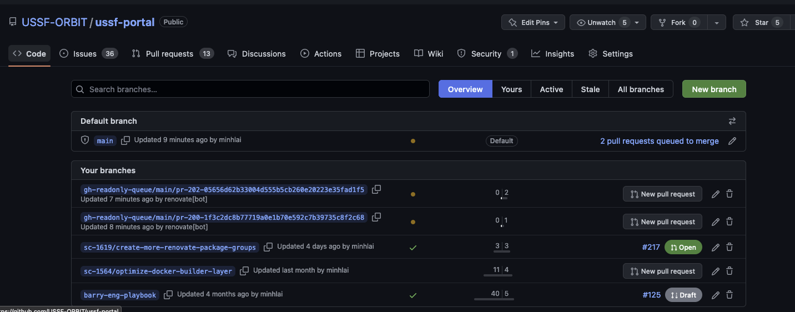
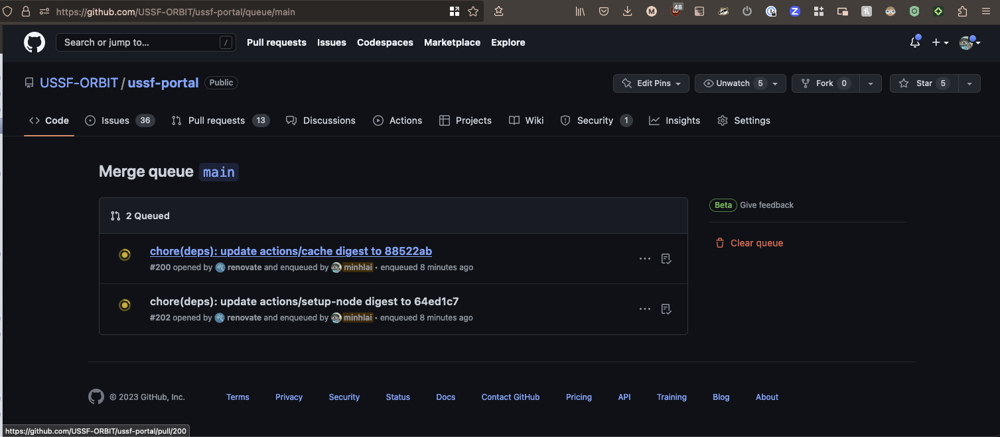
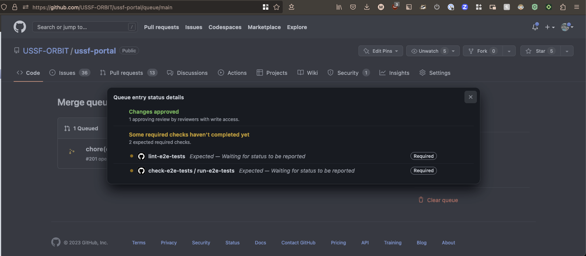
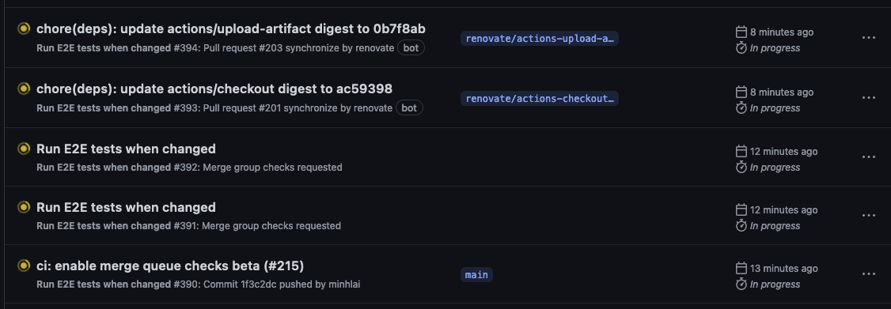

Merge queue notes:

When can something be added to the Merge Queue?
- You can slate a PR to be added to the queue before it is approved. Once approved and passing checks, it is pushed to the Queue
- You can slate a PR to be added to the queue before it is passing checks. Once it is passing checks, it is pushed to the Queue.

How does Merge Queue work?
- Merge Queue makes new temporary branches with the latest changes from the base branch, the changes from other pull requests already in the queue, and the changes from your pull request. That is pushed to the end of the Merge Queue.
- You can see the Merge Queue in `/branches` under `Default branch`
- CI will make sure all required status checks are passing before the branch is merged. You can see a Queue entry's status details to see what checks are required and the details of the GHA runs. 
- You can see which GHA runs are for the Merge Queue (filter by `Merge Group` event to see only Merge Queue runs). Unfortunately, it's not as simple to map the GHA run back to the original PR from the Actions view.

- When PRs in Merge Queue pass their checks, they are automatically merged in FIFO order.

Questions to answer:
- `github.head_ref` is not an available context in the temporary Merge Queue branches. We use this to checkout the equivalent branches for this PR in other repos during e2e tests. We can try [github.event.merge_group.head_ref](https://docs.github.com/en/webhooks-and-events/webhooks/webhook-events-and-payloads#merge_group)

Links:

[Merging a pull request with a merge queue](https://docs.github.com/en/pull-requests/collaborating-with-pull-requests/incorporating-changes-from-a-pull-request/merging-a-pull-request-with-a-merge-queue?tool=webui)

[Managing a merge queue](https://docs.github.com/en/repositories/configuring-branches-and-merges-in-your-repository/configuring-pull-request-merges/managing-a-merge-queue)

